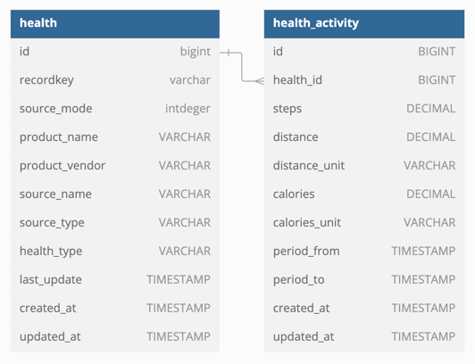

### ERD(데이터베이스 설게도)

- 단말에서 제공하는 정보는 HEALTH 테이블에 저장하였고 이에 대한 건강활동 정보는 HEALTH_ACTIVITY 테이블에 저장하였습니다.
- HEALTH_ACTIVITY와 HEALTH는 다대일 관계입니다.
  - JPA Entity간의 관계는 다대일 단방향으로 설정했습니다.
- 저장하는 정보 중 step, distance, calories 는 소수점값으로 정보의 손실이 발생하지 않고 소수점 정보를 저장할 수 있도록 Decimal 타입으로 정의하였습니다.
  - JPA Entity는 BigDecimal 타입으로 설정하였습니다. 

### 샘플코드

1. 파일 읽기 및 Service 호출
```java
public class HealthFileAdapter {
    // 그 외 코드 생략
    @Bean
    public ApplicationRunner applicationRunner() {
        return args -> {
            String[] fileNames = inputFileNames.split(",");
            List<HealthDto> healths = Arrays.stream(fileNames)
                    .map(fileName -> this.readFile(fileName))
                    .collect(Collectors.toList());
      
            healthUsecase.saveAll(healths);
        };
    }
  
    public HealthDto readFile(String fileName) {
        String filePath = "classPath:static/" + fileName; // /resources/static 하위 파일
        Resource resource = resourceLoader.getResource(filePath);
    
        try (InputStream inputStream = resource.getInputStream()) {
            String inputResource = FileCopyUtils.copyToString(new InputStreamReader(inputStream, StandardCharsets.UTF_8));
            HealthResource healthResource = objectMapper.readValue(inputResource, HealthResource.class);
            return healthResource.convertToDto();
        } catch (Exception e) {
            log.error("Convert To Health exception: {}", e.getMessage());
        }
    
        throw new IllegalArgumentException("Convert To Health exception");
    }
}
```
  - ApplicationRunner를 빈으로 생성하여 Spring Application이 구동된 후에 저장할 수 있도록 하였습니다.
  - 입력받은 파일값을 기준으로 데이터를 읽어왔고, ObjectMapper를 통해 Json타입을 객체형태로 Converting 하였습니다.
  
2. 여러 날짜 형태에 따른 Converting
```java
public class CustomDateDeserializer extends StdDeserializer<LocalDateTime> {
    // 이전 코드 생략
    @Override
    public LocalDateTime deserialize(JsonParser jp, DeserializationContext ctxt) throws IOException {
        String dateString = jp.getText();
        for (String format : DATE_FORMATS) {
            try {
                return LocalDateTime.parse(dateString, DateTimeFormatter.ofPattern(format));
            } catch (DateTimeParseException e) {
              // 포맷이 맞지 않으면 다음 포맷 시도
            }
        }
    
        log.error("Invalid date format: {}", dateString);
        throw new IllegalArgumentException("Invalid date format: " + dateString);
    }
}
```
```java
@JsonDeserialize(using = CustomDateDeserializer.class)
private LocalDateTime lastUpdate;
```
- 정의된 여러 형태의 데이터 형식에 맞게 파싱할 수 있게 하였습니다.
- 또한 해당 deserialize를 사용해야 하는 컬럼에는 JsonDeserialize를 정의하였습니다.

3. 데이터 저장
```java
public class HealthInputPort implements HealthUsecase {
    // 그 외 코드 생략
    @Override
    @Transactional
    public List<HealthDto> saveAll(List<HealthDto> healths) {
        return healths.stream()
                .map(health -> {
                  HealthDto saveHealth = healthOutputPort.save(health);
                  List<HealthActivityDto> healthActivities = healthActivityOutputPort.saveAll(health.getHealthActivities(), saveHealth);
                  saveHealth.setHealthActivities(healthActivities);
                  return saveHealth;
                })
                .collect(Collectors.toList());
    }
}
```
```java
public class HealthAdapter implements HealthOutputPort {
    // 그 외 코드 생략
    @Override
    public HealthDto save(HealthDto healthDto) {
        HealthEntity health = HealthEntity.save(healthDto);
        return healthRepository.save(health)
                .convertToDto();
    }
}
```
```java
public class HealthActivityAdapter implements HealthActivityOutputPort {
    // 그 외 코드 생략
    @Override
    public List<HealthActivityDto> saveAll(List<HealthActivityDto> healthActivityDtos, HealthDto healthDto) {
        return healthActivityDtos.stream()
                .map(healthActivityDto -> this.generateNewHealthActivityEntity(healthDto, healthActivityDto))
                .map(healthActivity -> healthActivityRepository.save(healthActivity).convertToDto())
                .collect(Collectors.toList());
    }

    private HealthActivityEntity generateNewHealthActivityEntity(HealthDto healthDto, HealthActivityDto healthActivityDto) {
        HealthEntity health = HealthEntity.byId(healthDto.getId());
        HealthActivityEntity healthActivity = HealthActivityEntity.save(healthActivityDto, health);

        return healthActivity;
    }
}
```
- Hexagonal Architecture를 사용하였습니다.
  - framework, usecase layer를 구분하였고, 각 레이어에 대한 호출은 port, adapter를 활용하였습니다.
- HealthEntity, HealthActivityEntity를 저장하였습니다.

### 데이터 조회 결과

- 서버 구동 후 API를 조회하여 결과를 확인할 수 있습니다. 서버 구동 시 MySQL 설정 확인 부탁드립니다.
  - 일별 조회
    - GET /healths?type=Daily
  - 월별 조회
    - GET /healths?type=Monthly

- 일별 조회 결과

|기간|STEP|DISTANCE|CALORIES|RECORDKEY|  
|---|---|---|---|---|
|2024-11-15|7243|5.4194896718|289.20995225|7836887b-b12a-440f-af0f-851546504b13|
|2024-11-16|10717|8.0204797034|425.52994815|7836887b-b12a-440f-af0f-851546504b13|
|2024-11-17|7390|5.608009659|288.48996584|7836887b-b12a-440f-af0f-851546504b13|
|2024-11-18|7928|6.03404989|316.6999822|7836887b-b12a-440f-af0f-851546504b13|
|2024-11-19|5857|4.483939313|232.44996358|7836887b-b12a-440f-af0f-851546504b13|
|2024-11-20|7762|5.8415798517|310.82996854|7836887b-b12a-440f-af0f-851546504b13|
|2024-11-21|5952|4.4632696545|236.67996438|7836887b-b12a-440f-af0f-851546504b13|
|2024-11-22|9692|7.3932293041|385.8399385|7836887b-b12a-440f-af0f-851546504b13|
|2024-11-23|7619|5.7530293665|303.1099578|7836887b-b12a-440f-af0f-851546504b13|
|2024-11-24|6285|4.8245898508|249.50998158|7836887b-b12a-440f-af0f-851546504b13|
|2024-11-25|6396|4.9175796168|256.8099664|7836887b-b12a-440f-af0f-851546504b13|
|2024-11-26|6815|5.111829809|280.8299739|7836887b-b12a-440f-af0f-851546504b13|
|2024-11-27|11522|8.7367195778|475.34995652|7836887b-b12a-440f-af0f-851546504b13|
|2024-11-28|9423|7.0484097933|385.35995593|7836887b-b12a-440f-af0f-851546504b13|
|2024-11-29|7773|5.8451199137|307.33998307|7836887b-b12a-440f-af0f-851546504b13|
|2024-11-30|6409|4.84076981|258.4599802|7836887b-b12a-440f-af0f-851546504b13|
|2024-12-01|6911|5.277709949|279.0099989|7836887b-b12a-440f-af0f-851546504b13|
|2024-12-02|5152|3.905699725|209.00998185|7836887b-b12a-440f-af0f-851546504b13|
|2024-12-03|9253|6.9904796797|366.0199735|7836887b-b12a-440f-af0f-851546504b13|
|2024-12-04|11100|8.3271197205|452.9199699|7836887b-b12a-440f-af0f-851546504b13|
|2024-12-05|13942|10.4508797352|549.57994807|7836887b-b12a-440f-af0f-851546504b13|
|2024-12-06|6069|4.600989641|244.98995902|7836887b-b12a-440f-af0f-851546504b13|
|2024-12-07|6835|5.1540094107|277.19997075|7836887b-b12a-440f-af0f-851546504b13|
|2024-12-08|2943|2.2430599723|115.39999552|7836887b-b12a-440f-af0f-851546504b13|
|2024-12-09|8659|6.6131799444|346.14996663|7836887b-b12a-440f-af0f-851546504b13|
|2024-12-10|6546|4.9617498627|265.08997843|7836887b-b12a-440f-af0f-851546504b13|
|2024-12-11|7513|5.587589773|302.81996664|7836887b-b12a-440f-af0f-851546504b13|
|2024-12-12|7093|5.414469529|285.36995387|7836887b-b12a-440f-af0f-851546504b13|
|2024-12-13|8102|6.1263096022|325.21995176|7836887b-b12a-440f-af0f-851546504b13|
|2024-12-14|4797|3.6570697181|191.79998186|7836887b-b12a-440f-af0f-851546504b13|
|2024-12-15|4245|3.209540023|167.8299982|7836887b-b12a-440f-af0f-851546504b13|
|2024-12-16|6432|4.8564797897|257.42998511|7836887b-b12a-440f-af0f-851546504b13|
|2024-11-15|9589|7.24323016|345.35993438|3b87c9a4-f983-4168-8f27-85436447bb57|
|2024-11-16|5075|4.2637902895|199.23999597|3b87c9a4-f983-4168-8f27-85436447bb57|
|2024-11-17|5179|3.9831101015|183.68998309|3b87c9a4-f983-4168-8f27-85436447bb57|
|2024-11-18|13291|10.2997199322|453.14989536|3b87c9a4-f983-4168-8f27-85436447bb57|
|2024-11-19|8203|6.3277802163|305.67995459|3b87c9a4-f983-4168-8f27-85436447bb57|
|2024-11-20|10055|7.7173402583|341.25993672|3b87c9a4-f983-4168-8f27-85436447bb57|
|2024-11-21|9114|6.9326903564|327.4399543|3b87c9a4-f983-4168-8f27-85436447bb57|
|2024-11-22|8496|6.540980794|291.91996593|3b87c9a4-f983-4168-8f27-85436447bb57|
|2024-11-23|5117|3.977679997|194.73996108|3b87c9a4-f983-4168-8f27-85436447bb57|
|2024-11-24|9089|6.9697801765|329.33995256|3b87c9a4-f983-4168-8f27-85436447bb57|
|2024-11-25|8660|6.6983400955|308.73994657|3b87c9a4-f983-4168-8f27-85436447bb57|
|2024-11-26|7930|6.081570335|281.51993236|3b87c9a4-f983-4168-8f27-85436447bb57|
|2024-11-27|9566|7.253210088|350.05996667|3b87c9a4-f983-4168-8f27-85436447bb57|
|2024-11-28|9769|7.3867001783|347.76998061|3b87c9a4-f983-4168-8f27-85436447bb57|
|2024-11-29|8698|6.6835101464|303.98998313|3b87c9a4-f983-4168-8f27-85436447bb57|
|2024-11-30|3114|2.3598000102|107.86999478|3b87c9a4-f983-4168-8f27-85436447bb57|
|2024-12-01|6920|5.4873501397|228.81998295|3b87c9a4-f983-4168-8f27-85436447bb57|
|2024-12-02|8194|6.2090199387|294.77996709|3b87c9a4-f983-4168-8f27-85436447bb57|
|2024-12-03|11103|8.527580109|383.3199707|3b87c9a4-f983-4168-8f27-85436447bb57|
|2024-12-04|8507|6.4470800127|308.81997341|3b87c9a4-f983-4168-8f27-85436447bb57|
|2024-12-05|10329|7.86841996|375.1299691|3b87c9a4-f983-4168-8f27-85436447bb57|
|2024-12-06|12300|9.4888507254|419.25991597|3b87c9a4-f983-4168-8f27-85436447bb57|
|2024-12-07|5063|4.4469398317|220.86999704|3b87c9a4-f983-4168-8f27-85436447bb57|
|2024-12-08|5353|4.201040036|183.439994|3b87c9a4-f983-4168-8f27-85436447bb57|
|2024-12-09|5740|4.4660499731|191.12998108|3b87c9a4-f983-4168-8f27-85436447bb57|
|2024-12-10|9249|7.1584999675|320.29998555|3b87c9a4-f983-4168-8f27-85436447bb57|
|2024-12-11|10467|8.13616998644|350.55997265|3b87c9a4-f983-4168-8f27-85436447bb57|
|2024-12-12|10929|8.3910098861|372.06995968|3b87c9a4-f983-4168-8f27-85436447bb57|
|2024-12-13|9349|7.2183498933|314.53997513|3b87c9a4-f983-4168-8f27-85436447bb57|
|2024-12-14|4154|3.1663400222|145.76999244|3b87c9a4-f983-4168-8f27-85436447bb57|
|2024-12-15|3412|2.632960042|116.97999439|3b87c9a4-f983-4168-8f27-85436447bb57|
|2024-12-16|9482|7.2513000017|334.33997099|3b87c9a4-f983-4168-8f27-85436447bb57|
|2024-11-14|2234.54914817529465|1.78763931854023578|0|7b012e6e-ba2b-49c7-bc2e-473b7b58e72e|
|2024-11-15|6678.913753429320673|5.343131002743456627|0|7b012e6e-ba2b-49c7-bc2e-473b7b58e72e|
|2024-11-16|5496.563376212808591|4.397250700970247116|0|7b012e6e-ba2b-49c7-bc2e-473b7b58e72e|
|2024-11-17|4712.999999999999914|3.770399999999999909|0|7b012e6e-ba2b-49c7-bc2e-473b7b58e72e|
|2024-11-18|10236.497989637448505|8.189198391709959226|0|7b012e6e-ba2b-49c7-bc2e-473b7b58e72e|
|2024-11-19|7796.35259017209778|6.237082072137678425|0|7b012e6e-ba2b-49c7-bc2e-473b7b58e72e|
|2024-11-20|6163.999999999999838|4.93120000000000006|0|7b012e6e-ba2b-49c7-bc2e-473b7b58e72e|
|2024-11-21|7730.00000000000085|6.18400000000000015|0|7b012e6e-ba2b-49c7-bc2e-473b7b58e72e|
|2024-11-22|9901.0000000000002128|7.9208000000000003924|0|7b012e6e-ba2b-49c7-bc2e-473b7b58e72e|
|2024-11-23|8622.520268911600939|6.898016215129280872|0|7b012e6e-ba2b-49c7-bc2e-473b7b58e72e|
|2024-11-24|4484.573887480746508|3.587659109984597637|0|7b012e6e-ba2b-49c7-bc2e-473b7b58e72e|
|2024-11-25|7491.163252319259314|5.9929306018554078177|0|7b012e6e-ba2b-49c7-bc2e-473b7b58e72e|
|2024-11-26|8441.367794767592167|6.753094235814074243|0|7b012e6e-ba2b-49c7-bc2e-473b7b58e72e|
|2024-11-27|8815.999999999999791|7.052800000000000326|0|7b012e6e-ba2b-49c7-bc2e-473b7b58e72e|
|2024-11-28|7832.868331045778018|6.266294664836622394|0|7b012e6e-ba2b-49c7-bc2e-473b7b58e72e|
|2024-11-29|5897.315815519749161|4.717852652415799559|0|7b012e6e-ba2b-49c7-bc2e-473b7b58e72e|
|2024-11-30|5326.214780435165979|4.260971824348133097|0|7b012e6e-ba2b-49c7-bc2e-473b7b58e72e|
|2024-12-01|7442.999999999999962|5.95440000000000027|0|7b012e6e-ba2b-49c7-bc2e-473b7b58e72e|
|2024-12-02|5908.3010382097878274|4.7266408305678305767|0|7b012e6e-ba2b-49c7-bc2e-473b7b58e72e|
|2024-12-03|9561.619036562310568|7.6492952292498483807|0|7b012e6e-ba2b-49c7-bc2e-473b7b58e72e|
|2024-12-04|8164.893757196190464|6.531915005756952385|0|7b012e6e-ba2b-49c7-bc2e-473b7b58e72e|
|2024-12-05|7242.000000000000176|5.793600000000000054|0|7b012e6e-ba2b-49c7-bc2e-473b7b58e72e|
|2024-12-06|5952.217740237867568|4.761774192190294212|0|7b012e6e-ba2b-49c7-bc2e-473b7b58e72e|
|2024-12-07|11768.0471890194998899|9.4144377512156007286|0|7b012e6e-ba2b-49c7-bc2e-473b7b58e72e|
|2024-12-08|5751.698480674177875|4.6013587845393427478|0|7b012e6e-ba2b-49c7-bc2e-473b7b58e72e|
|2024-12-09|6465.9965985230098046|5.1727972788184082045|0|7b012e6e-ba2b-49c7-bc2e-473b7b58e72e|
|2024-12-10|8041.000000000000207|6.432800000000000138|0|7b012e6e-ba2b-49c7-bc2e-473b7b58e72e|
|2024-12-11|8734.34597979522092532|6.98747678383617699748|0|7b012e6e-ba2b-49c7-bc2e-473b7b58e72e|
|2024-12-12|8510.000000000000486|6.808000000000000121|0|7b012e6e-ba2b-49c7-bc2e-473b7b58e72e|
|2024-12-13|7315.0259768848208347|5.8520207815078567144|0|7b012e6e-ba2b-49c7-bc2e-473b7b58e72e|
|2024-12-14|7114.364401832300794|5.6914915214658406842|0|7b012e6e-ba2b-49c7-bc2e-473b7b58e72e|
|2024-12-15|4004.6355981676991476|3.2037084785341594861|0|7b012e6e-ba2b-49c7-bc2e-473b7b58e72e|
|2024-11-14|2079.000000000000125|1.6632000000000001997|0|e27ba7ef-8bb2-424c-af1d-877e826b7487|
|2024-11-15|7902.0000000000002|6.3216000000000003|0|e27ba7ef-8bb2-424c-af1d-877e826b7487|
|2024-11-16|9143.99999999999987|7.31520000000000037|0|e27ba7ef-8bb2-424c-af1d-877e826b7487|
|2024-11-17|2292|1.83360000000000001|0|e27ba7ef-8bb2-424c-af1d-877e826b7487|
|2024-11-18|13694.000000000000592|10.955200000000000485|0|e27ba7ef-8bb2-424c-af1d-877e826b7487|
|2024-11-19|12225.00000000000082|9.78000000000000065|0|e27ba7ef-8bb2-424c-af1d-877e826b7487|
|2024-11-20|5378.999999999999976|4.303200000000000123|0|e27ba7ef-8bb2-424c-af1d-877e826b7487|
|2024-11-21|9493.99999999999979|7.5952000000000003|0|e27ba7ef-8bb2-424c-af1d-877e826b7487|
|2024-11-22|6521.99999999999999|5.217600000000000134|0|e27ba7ef-8bb2-424c-af1d-877e826b7487|
|2024-11-23|8242.999999999999895|6.59440000000000026|0|e27ba7ef-8bb2-424c-af1d-877e826b7487|
|2024-11-24|2353.00000000000008|1.88240000000000018|0|e27ba7ef-8bb2-424c-af1d-877e826b7487|
|2024-11-25|12568.99999999999982|10.05520000000000066|0|e27ba7ef-8bb2-424c-af1d-877e826b7487|
|2024-11-26|7677.97643979942892|6.142381151839543872|0|e27ba7ef-8bb2-424c-af1d-877e826b7487|
|2024-11-27|7337.02356020057056|5.86961884816045655|0|e27ba7ef-8bb2-424c-af1d-877e826b7487|
|2024-11-28|7747.00000000000004|6.19760000000000018|0|e27ba7ef-8bb2-424c-af1d-877e826b7487|
|2024-11-29|8700.99999999999959|6.960800000000000528|0|e27ba7ef-8bb2-424c-af1d-877e826b7487|
|2024-11-30|12885.99999999999966|10.30879999999999981|0|e27ba7ef-8bb2-424c-af1d-877e826b7487|
|2024-12-01|2136.879460064185996|1.709503568051348781|0|e27ba7ef-8bb2-424c-af1d-877e826b7487|
|2024-12-02|12055.120539935813807|9.64409643194865161|0|e27ba7ef-8bb2-424c-af1d-877e826b7487|
|2024-12-03|6741.00000000000005|5.39280000000000036|0|e27ba7ef-8bb2-424c-af1d-877e826b7487|
|2024-12-04|14753.99999999999991|11.80320000000000043|0|e27ba7ef-8bb2-424c-af1d-877e826b7487|
|2024-12-05|10797.9999999999997|8.63840000000000041|0|e27ba7ef-8bb2-424c-af1d-877e826b7487|
|2024-12-06|8658.00000000000009|6.92640000000000032|0|e27ba7ef-8bb2-424c-af1d-877e826b7487|
|2024-12-07|10269.00000000000089|8.21520000000000068|0|e27ba7ef-8bb2-424c-af1d-877e826b7487|
|2024-12-08|11653.99999999999985|9.32320000000000048|0|e27ba7ef-8bb2-424c-af1d-877e826b7487|
|2024-12-09|10905.99999999999917|8.72480000000000066|0|e27ba7ef-8bb2-424c-af1d-877e826b7487|
|2024-12-10|12887.999999999999896|10.310400000000000331|0|e27ba7ef-8bb2-424c-af1d-877e826b7487|
|2024-12-11|12712.000000000000074|10.169600000000000286|0|e27ba7ef-8bb2-424c-af1d-877e826b7487|
|2024-12-12|8803.0000000000000738|7.0424000000000003188|0|e27ba7ef-8bb2-424c-af1d-877e826b7487|
|2024-12-13|8338.000000000000184|6.670400000000000152|0|e27ba7ef-8bb2-424c-af1d-877e826b7487|
|2024-12-14|5350|4.28000000000000028|0|e27ba7ef-8bb2-424c-af1d-877e826b7487|
|2024-12-15|787.99999999999999997|0.63040000000000000098|0|e27ba7ef-8bb2-424c-af1d-877e826b7487|

- 월별 조회 결과

|기간|STEP|DISTANCE|CALORIES|RECORDKEY|  
|---|---|---|---|---|
|2024-11|124783|94.3420947854|5002.49943884|7836887b-b12a-440f-af0f-851546504b13|
|2024-12|115592|87.3763360755|4635.83958001|7836887b-b12a-440f-af0f-851546504b13|
|2024-11|130945|100.7192331351|4671.7693381|3b87c9a4-f983-4168-8f27-85436447bb57|
|2024-12|130551|101.09696052554|4560.12960217|3b87c9a4-f983-4168-8f27-85436447bb57|
|2024-11|117862.9009881068628908|94.2903207904854936311|0|7b012e6e-ba2b-49c7-bc2e-473b7b58e72e|
|2024-12|111977.14579710288652952|89.58171663768231170048|0|7b012e6e-ba2b-49c7-bc2e-473b7b58e72e|
|2024-11|136244.999999999999928|108.9960000000000046117|0|e27ba7ef-8bb2-424c-af1d-877e826b7487|
|2024-12|136850.99999999999969077|109.48080000000000509978|0|e27ba7ef-8bb2-424c-af1d-877e826b7487|
